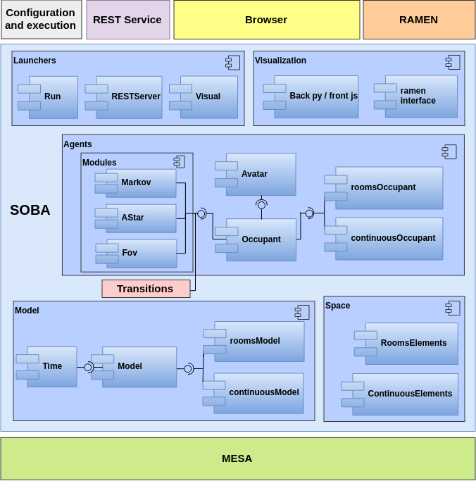

SOBA Overview
=============

`SOBA <https://github.com/gsi-upm/soba>`_. is a new system of Simulation of Occupancy Based on Agents implemented in `Python <http://www.python.org/>`_., which has become an increasingly popular language for scientific computing.

This software is useful for conducting studies based on occupancy simulations, mainly in buildings, such as drill simulation or energy studies. 

The simulations are configured by declaring one or more types of occupants, with specific and definable behavior, a physical space (rooms of the building) and agents that are interconnected with each other and with the occupants. The simulation and results can be evaluated both in real time and post-simulation.

It is provided as open source software:

``Github repository``:
https://github.com/gsi-upm/soba

Arquitecture Description
------------------------

SOBA is implemented through 5 modules which group independent components with a related function.

- Module **Model**.
	- **Model**. This component is the core of the simulations. The model creates and manages space and agents, provides a scheduler that controls the agents activation regime, stores model-level parameters and serves as a container for the rest of components.
	- Time. Component of time management during the simulation in sexagesimal units and controller of the scheduler during the simulation.

- Module **Agents**.
	- **Agent**. Base class to define any type of agent, which performs actions and interactions within a model.
	- **Occupant**. An object of the Occupant class is a type of agent developed and characterized to simulate the behavior of crowds in buildings.
	- Occupancy module.
		- **Markov**.
		- AStar. Auxiliar class used by the occupants to move in the building.
		- `FOV <http://www.roguebasin.com/index.php?title=Permissive_Field_of_View>`_.This component is a permissive field of view, which is useful to define the occupant visibility.
	- `Transitions <https://github.com/pytransitions/transitions#threading>`_. This external package is a lightweight, object-oriented state machine implementation in Python.

- Module **Space**.
	- **Grid**. The space where the agents are situated and where they perform their actions is defined by means of a grid with coordinates (x, y).
	- ContinuousItems / RoomsItems. Various classes that define the representation of physical space objects in the model.

- Module Visualization. Two components provide a simple mechanism to represent the model in a web interface, based on HTML rendering though a server interface, implemented with web sockets.

- Module Launchers. The simulation will be executed defining a type of perfomance: in bacth or with visual representation.
